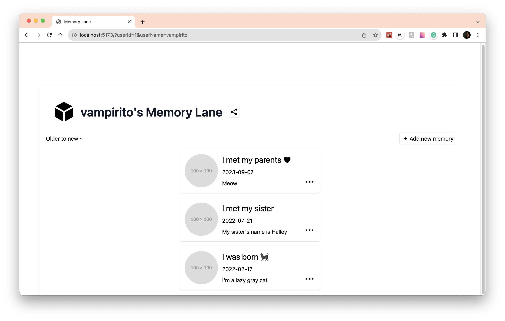

# Planned coding challenge: Memory lane

## Details about my implementation
#### Frontend 🖼️
- When the application renders the first time, it checks for the `userId` in the URL params (using the browser API `URLSearchParams`).
  - If the `userId` doesn't exist, it shows a modal implemented using `react-modal` to create a new user and store it in the Database and the URL params.
  - If the `userId` exists, it shows the user's memory lane that consists of a list of cards with the title, the description, the date and a placeholder for the image.
- The user can create a new memory card by clicking on the "Add new memory" button.
  - When the user clicks on the button a modal is shown with a form to enter the memory data.
  - The form handling and validation was implemented using `Formik` and `Yup` libraries.
- The user can edit each memory by clicking on the "..." button and selecting the "Edit Memory" option.
- The user can delete the memory by clicking on the "..." button and selecting the "Delete Memory" option.
- The Share button was implemented using the browser's `Clipboard` API to copy the URL, and once is copied it shows a confirmation to the user.
- The styling for the whole app was implemented using `tailwindcss` and custom styles as js objects for the modals.
#### Backend 🖥️
- The Database was modified to create a `users` table and the `memories` table was modified to add a `user_id` column as a foreign key.
- The API was modified to create users using a new endpoint `/users`.
- The API was also modified to get the memories by `userId` with a new endpoint `/users/:userId/memories`.
- In order to allow CORS I installed `cors` library and added it to the express app.

#### Wall of shame - Things that I didn't have time to implement 🫣
- Testing.
- Sign up and Sign in functionality.
- Proper routing.
- The image upload/edit/delete functionality.
- The time sorting for the list of memories.
- Error handling.

### Problem definition

After a series of discovery calls we found out a problem that our users are facing. They are having a hard time sharing their memories with friends and family. They are using a combination of social media, messaging apps, and email to share their memories. They are also using a combination of cloud storage, social media, and messaging apps to store their memories. They are looking for a solution that allows them to store and share their memories in a single place.

As a first iteration for this solution, we want to build a web application that allows users to create a memory lane and share it with friends and family. A memory lane is a collection of events that happened in a chronological order. Each event consists of a title, a description, a timestamp, and at least one image.

## Deliverables

- Clone this repository and create a new branch with your name. Open a pull request on your own instance of the repository.
- An updated README providing a high level explanation of your implementation.
- Update the API to accommodate for your technical design. Run the API by using `npm run serve:api`.
- The provided mockup is only for reference and inspiration. Feel free to improve it!

### Inspiration mockup

